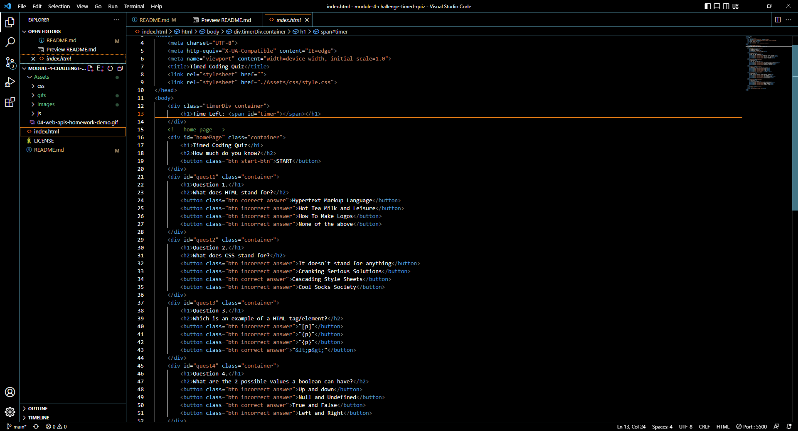
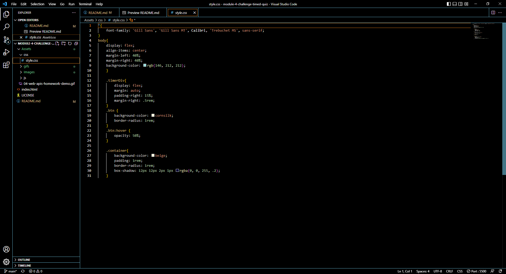
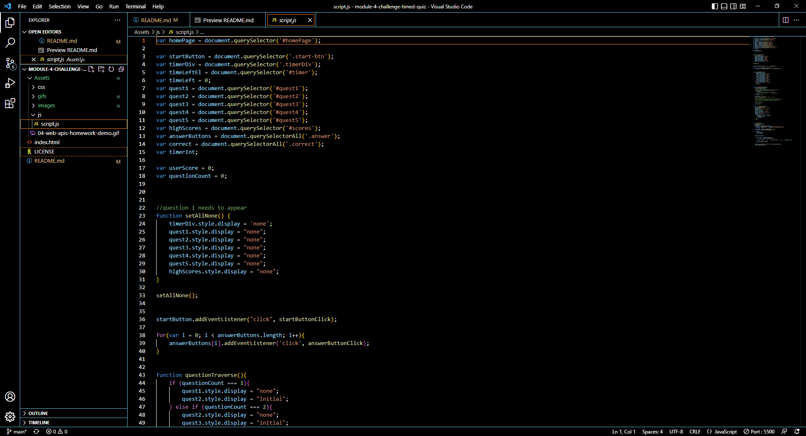

# Module 04 Challenge Web APIs: Code Quiz
## -->[Link to the Deployed page](https://thvt1guy.github.io/module-4-challenge-timed-quiz/)<--

## Coded from scratch
- When the correct answer is click +1 is added to score
- Max score is 5
- When clicking incorrect answer -10secs
- Score is logged into local storage and listed out after the quiz is finished

## WEBSITE PAGE GIF

## HTML FILE IMAGE

## CSS FILE IMAGE

## JavaScript FILE IMAGE

